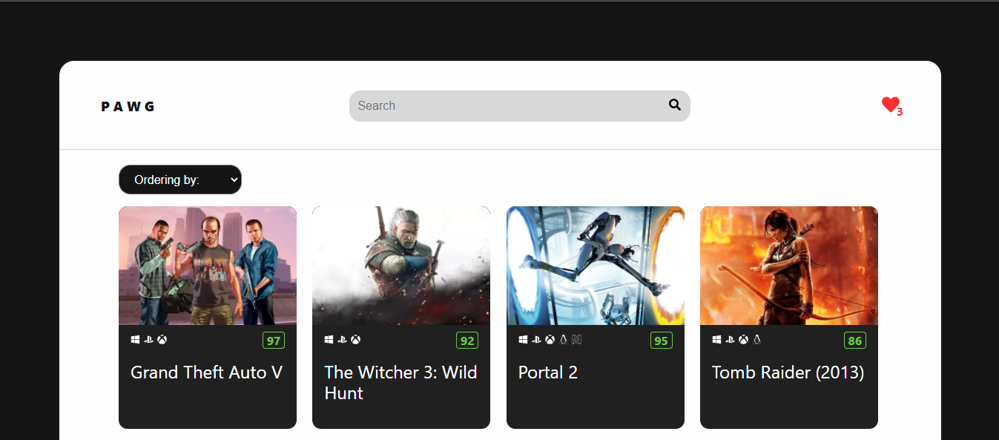

<h1 align="center">Test task "GamePortal"</h1>



## Description

This training project is based on the [RAWG API](https://api.rawg.io/docs/). 

This is a game portal where you can view the games you are interested in, sort them by release date or by popularity. There is also a search for games, adding to the desired list and going to the stores where they are sold.

## About the project

### Intersection Observer API
- In this project it is used Intersection Observer API for endless pagination of game cards.
- Various UI libraries were not used to implement infinite scrolling.

### Searching and filtering
- The search for games is carried out using a custom useDebounce hook, which reduces the number of requests to the server.
- Sorting by games is carried out through requests from the server and changes every time the user's filter changes.

### Wishlist
- Adding games to the desired list is done via localstorage.

## Project setup

```
npm start
```

Runs the app in the development mode.\
Open [http://localhost:3000](http://localhost:3000) to view it in your browser.

The page will reload when you make changes.\
You may also see any lint errors in the console.

```
npm build
```

Builds the app for production to the `build` folder.\
It correctly bundles React in production mode and optimizes the build for the best performance.

The build is minified and the filenames include the hashes.\
Your app is ready to be deployed!

